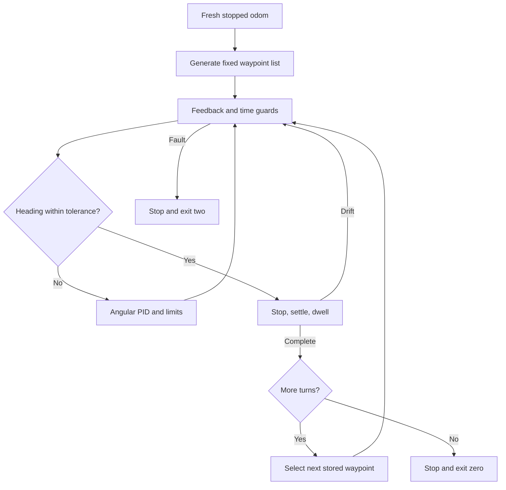
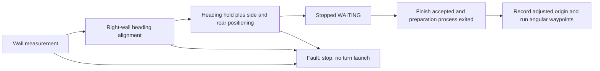
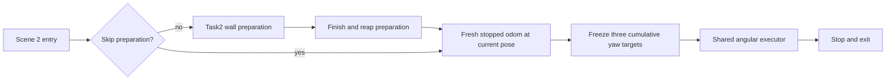

# Turn control flow

1. Validate configuration and wait for fresh, stopped odom.
2. Generate all cumulative heading waypoints once from the initial pose; activate the first.
3. Compare that fixed target with accepted odom yaw; PID commands angular.z only.
4. Within angular tolerance: zero command, qualify stopped feedback, then dwell.
5. If disturbed, restart qualification; otherwise advance or stop and exit.
6. Feedback, time, or segment deadline failure: zero command and exit code 2.

The waypoint list is written only during initialization. begin_turn() selects a stored
target. on_odom() updates feedback; tick()
selects tracking or completion. No distance controller runs concurrently.

## Optional preparation sequence

See start_preparation.md. The coordinator never resumes Task2's previewed AB route.

## Task4 lifecycle

